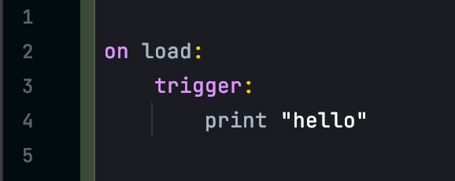

# Getting Started

ByteSkript allows scripts to be run in a standalone environment from the command-line. Some versions may be attached to other applications (e.g. a Minecraft server) but for simplicity this guide assumes you are using the basic version.

### Installing ByteSkript

The latest ByteSkript version can be downloaded from the [GitHub Releases](https://github.com/Moderocky/ByteSkript/releases) page.

There are **three** main executable Jars here.

* **SkriptLoader**: loads and runs user-created scripts.\
  This is the best option for creating and running scripts locally.
* **SkriptJarBuilder**: compiles scripts into an executable jar file.\
  This is useful for building shareable versions of the program with no dependencies.
* **SkriptCompiler**: compiles scripts into raw classes.\
  This is designed for language developers - these files are not directly executable.

This guide is written for using **SkriptLoader**.


**Make sure you have** [**Java**](https://www.oracle.com/java/technologies/javase/jdk17-archive-downloads.html) **installed.**

ByteSkript always runs on the latest Java version (currently 17.)


### Setting up Your Environment

The first time you run ByteSkript it will create all of the necessary folders and files for you.

1. Place the downloaded `SkriptLoader.jar` into an empty folder.&#x20;
2. Run the Jar file with `java -jar path/to/SkriptLoader.jar`.\
   Windows users can do this through command prompt or by [creating a clickable bat file](https://stackoverflow.com/questions/394616/running-jar-file-on-windows).\
   Mackintosh/Linux users can do this through terminal or by [creating a clickable shell file](https://coderedirect.com/questions/534005/script-to-run-jar-file-on-mac-os-x).

This should create **four** folders next to the ByteSkript jar.

The `skript/` folder is the most important.

| Folder      | Description                                                                                                                                                           |
| ----------- | --------------------------------------------------------------------------------------------------------------------------------------------------------------------- |
| `skript`    | This is where you put the scripts you write. Any `.bsk` file in this directory will be run.                                                                           |
| `libraries` | This is where you can install third-party syntax libraries. Place the Jar/class in this folder.                                                                       |
| `resources` | This is for adding extra text/data files that you want to package inside your compiled scripts. If you are using **SkriptLoader** you do not need to use this folder. |
| `compiled`  | If you are using **SkriptCompiler** or **SkriptJarBuilder** the compiled output will go here.                                                                         |

### Writing Your First Script

Any file with a name ending in `.bsk` in the `skript/` folder will be seen and loaded by ByteSkript.


While a basic app like Notepad++ or TextEdit is sufficient, a code-editing app like GitHub's [Atom](https://atom.io), Microsoft's [VSCode](https://code.visualstudio.com) or JetBrains [IntelliJ](https://www.jetbrains.com/idea/) may be more useful.


Start by creating a new script file called `myscript.bsk` in the `skript/` folder. You can open this file in your editor app.

For testing, we can start by writing a simple trigger for the `on [script] load` [event](../structures/members/events.md).



This `on load` event will be run when your script is loaded, but never again.

```clike
on load:
    trigger: // the code to be run goes inside triggers
        print "hello" // prints hello to the command-line
```

Our `trigger:` section needs to be indented inside the `on load:` event. This is to tell ByteSkript that the trigger belongs to this event.


You can indent using tabs **or** spaces (2, 4, 8, etc.) but **not** a mixture of both!


The `print "hello"` [effect](../structures/effects/generic-effects.md#print) will print a line to the system output (command-line.) You can read more about this and other effects in the [documentation](../structures/effects/generic-effects.md#print).

Once you've saved your `myscript.bsk` file, you can run it using the [**SkriptLoader**](getting-started.md#running-your-scripts).

You should see a "hello" output in your console.


```log
hello

```


By default, the program will run until you kill it by closing the console window. On a UNIX terminal, `CTRL + C` will end the program.

If we want it to end automatically, we can add an `exit program` [effect](../structures/effects/flow-control-effects.md#exit-program) to our trigger.

.png>)

This effect will end the JVM process. If we re-run the **SkriptLoader** now, it will automatically terminate after printing `hello` to the console.

#### Introducing Another Effect

Let's make our program a little more complex and introduce the [wait](../structures/effects/generic-effects.md#wait-for) effect.

```clike
on load:
    trigger:
        print "hello"
        wait 3 seconds // waits for three seconds
        print "I waited for you"
        exit program
```

In this version, the program will wait for three seconds before printing the second output. Nothing will happen during this time.

#### Introducing a Variable

Currently our program is very simple. To add more complex behaviour, we will need to introduce [variables](../structures/expressions/variables.md).

Variables are in-program containers to store data. There are currently four types, but for now we will use the most basic one.

Variables use a `{var_name}` pattern. The name can contain alphaneumeric characters and `_` but **must** start with an `a-z` letter character.

Instead of directly printing `"hello"` we can try introducing a variable.

```clike
on load:
    trigger:
        set {var} to "hello" // sets the variable
        print {var} // gets the variable value
        exit program
```

For more information about using variables see [here](../structures/expressions/variables.md).

#### Adding a Function

Rather than writing all of our code inside the load event `trigger`, we can organise it by breaking it up into separate **functions**.

We can add a new function to the same `myscript.bsk` file.

```clike
function my_function:
    trigger:
        print "This was run from a function!"
```

The `function ...` declaration goes on the root level of the file and is **not** indented.

Our whole file should now look like this.


```clike
on load:
    trigger:
        set {var} to "hello"
        print {var}
        exit program

function my_function:
    trigger:
        print "This was run from a function!"
```


Currently, our function won't do anything since nothing is running it.

We can call it using the [run effect](../structures/effects/flow-control-effects.md#run) with `run my_function()`. &#x20;


```clike
on load:
    trigger:
        set {var} to "hello"
        print {var}
        run my_function() // my_function will be run here
        print "a function was run" // this happens after the function finishes
        exit program

function my_function:
    trigger:
        print "this was run from a function"
```


When running our script, we should now see the following output.


```log
hello
this was run from a function
a function was run
```


To make our function more useful, we can give it some parameters. This will allow us to provide argument values when we run it.

```clike
function my_function (name, number):
    trigger:
        print "this was run from a function"
```

We can use these parameters like variables with `{name}` and `{number}` inside this function.

```clike
function my_function (name, number):
    trigger:
        print "The name is " + {name}
        print "The number is " + {number}
```


The `+` operator can be used to join text together.

Running `"hello " + "there"` will join these to make `"hello there"`.


In order to use this function we will need to give it the `name` and `number` arguments when it's run. We can put these inside the `()` brackets in the run effect.


```clike
on load:
    trigger:
        run my_function("hello", 6)
        exit program

function my_function (name, number): // "hello", 6
    trigger:
        print "The name is " + {name} // hello
        print "The number is " + {number} // 6
```


We can also use variables as function arguments.


```clike
on load:
    trigger:
        set {a} to "Bob"
        set {b} to 4
        run my_function({a}, {b})
        exit program

function my_function (name, number):
    trigger:
        print "The name is " + {name} // Bob
        print "The number is " + {number} // 4
```


To learn more about using functions, see [here](../structures/members/functions.md).

To learn more about using variables, see [here](../structures/expressions/variables.md).

This site contains documentation for all syntax and language features, with explanations, examples and information about how they work.

By experimenting with the provided examples and following the simple grammar rules you should be able to learn the language quickly and use it.

### Running Your Scripts

To run your scripts, simply follow the same instructions as when [setting up ByteSkript](getting-started.md#setting-up-your-environment).

Scripts can be run with `java -jar path/to/SkriptLoader.jar` or by clicking your shell/bat file, if you created one.

This will tell **SkriptLoader** to load and run all scripts with the `.bsk` extension inside the `skript/` folder.

An `on load` event will be triggered for each one.

#### Using SkriptJarBuilder?

If you used **SkriptJarBuilder** instead of **SkriptLoader**, a new Jar file will have been created in the `compiled/` folder. It will be called `CompiledScripts.jar` by default, but you can change the name.

This Jar file can be run using `java -jar path/to/CompiledScripts.jar`.
